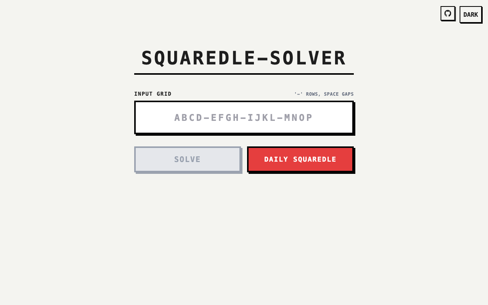
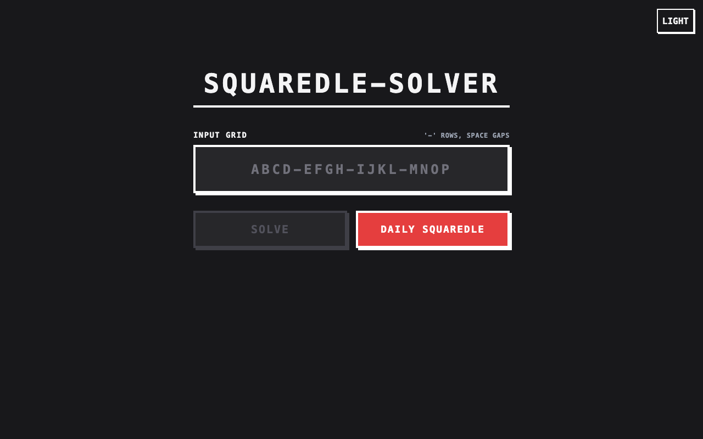
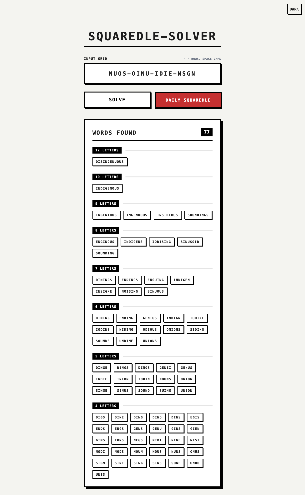
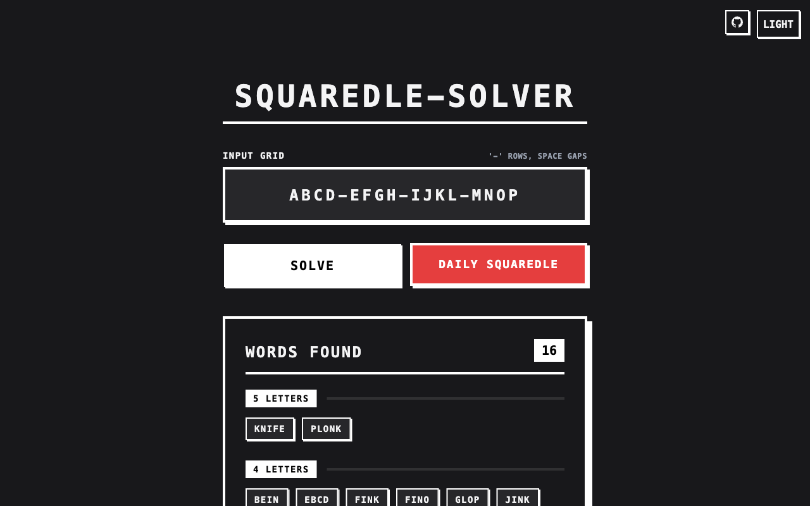

# SQUAREDLE-SOLVER

[](https://github.com/HEKPYTO/SQUAREDLE-SOLVER/actions/workflows/ci.yml)
[](https://elixir-lang.org/)
[](https://www.phoenixframework.org/)

A fast full-stack Elixir/Phoenix solver for the popular word-finding game [Squaredle](https://squaredle.app). Not affiliated with squaredle.app.

## Screenshots

| Light | Dark |
|-------|------|
|  |  |
|  |  |

## Features

- Core Algorithm: Depth-First Search (DFS) combined with an in-memory Prefix Trie and bitmask path validation.
- Daily Puzzle Support: Fetches today's puzzle configuration from the official site.
- Minimalist UI: A clean, Neo-brutalist interactive frontend built with Phoenix LiveView and Tailwind CSS.
- Dark/Light Mode: Toggle via button or spacebar shortcut, persisted to localStorage.
- Production Ready: Ships with an Alpine Dockerfile and Docker Compose orchestration with Traefik support.

## Prerequisites

If running locally without Docker:
* [Elixir](https://elixir-lang.org/install.html) 1.16+
* Erlang/OTP 26+

If running via Docker:
* [Docker](https://docs.docker.com/get-docker/)
* [Docker Compose](https://docs.docker.com/compose/install/)

## Quickstart (Docker)

```bash
git clone https://github.com/HEKPYTO/SQUAREDLE-SOLVER.git
cd SQUAREDLE-SOLVER

# Build the release and boot the server
docker compose up --build -d
```

Visit the application at [`http://localhost:4000`](http://localhost:4000).

## Local Development

```bash
mix deps.get
mix phx.server
```

## Testing

Run the test suite and verify coverage:
```bash
MIX_ENV=test mix coveralls
```

## License

This project is licensed under the MIT License.
